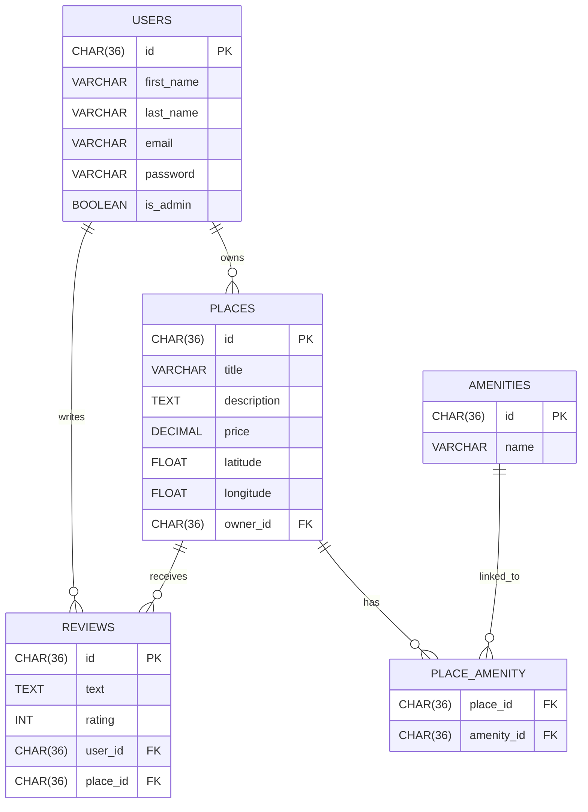
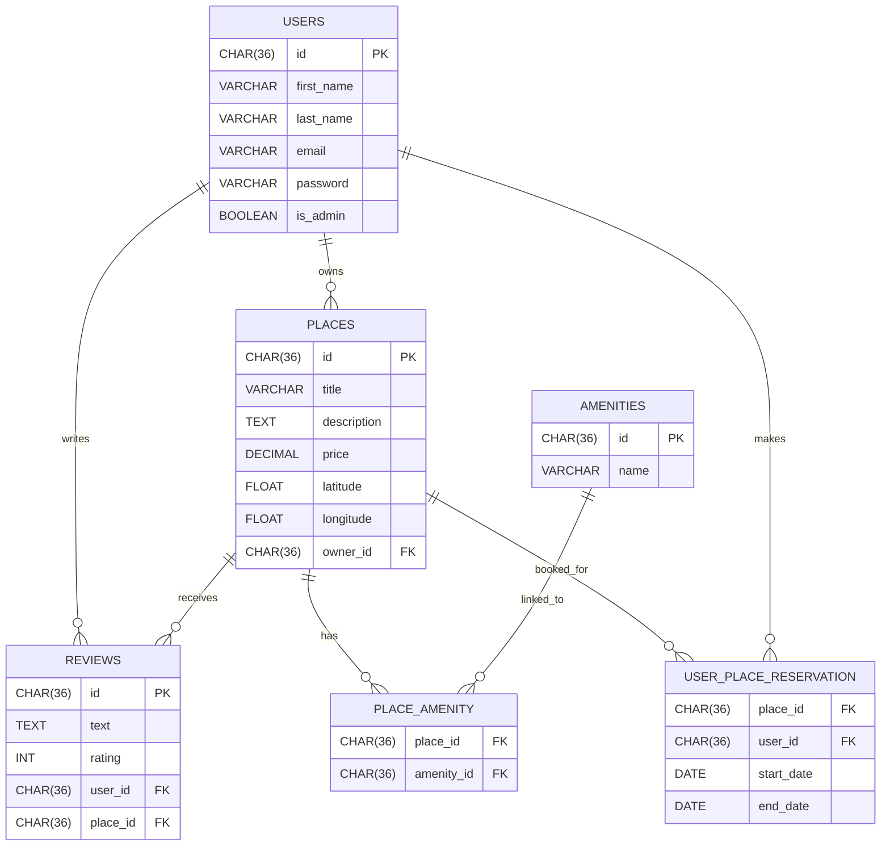

# Welcome to the HBNB Project - A simplified version of an AirBnB-like application

## Presentation

HBnB is a RESTful API inspired by the AirBnB website, developed in Python using Flask / Flask-RESTX and sqlalchemy.

The project was carried out in four parts.
- The first involved creating graphics
- The second implementing logic with API endpoints
- The third user authentication and database integration
- The fourth and final part involved using the front end for the aesthetic and dynamic aspects of the website (HTML, CSS, JavaScript) and alsoenabling communication between the back end and the front end.

## Project Objectives

📋 Part1 -> HBnB - UML
The project follows a three-layer architecture (presentation, business logic, persistence) introduced in Part 1 of the HBnB project.

📚 Part2 -> HBnB - BL and API
The objective of this phase is to build the presentation and business logic layers of the application using Python and Flask. Basic features such as classes, methods, and the necessary endpoints have been implemented.
Subsequently, the API structure (user management, locations, reviews, and amenities) was implemented using Flask and flask-restx, following API design best practices.

📬 Part3 -> HBnB - Auth & D
In this section, we will extend the HBnB project backend by adding user authentication, authorisation (access management), and database integration with SQLAlchemy and SQLite (for development). MySQL will be used in production. This step aims to secure the application, ensure data persistence, and prepare the backend for scalable and realistic deployment.

📰	Part4 -> HBnB - Simple Web Client
For this last phase, we will focus on the front-end using HTML, CSS3, and JavaScript ES6. The objective is to implement an interactive user interface that connects to the back-end service created in the previous sections.


## Technology Stack

- Flask – Web framework for API development
- Flask-JWT-Extended – JWT-based authentication
- SQLAlchemy – ORM for database modeling
- SQLite – Development database
- MySQL – Target production database
- Mermaid.js – ER diagram visualization tool
- email_validator - good email format validation
- flask-bcrypt - password hashing
- flask_sqlalchemy - SQLAlchemy integration for Flask 
- PyJWT - JSON Web Token implementation 
- flask-cors - Handling Cross-Origin Resource Sharing (CORS) in Flask 

## Key Deliverables

A secure and scalable backend API with authentication and authorization.  
A fully connected relational database schema using SQLAlchemy models.  
Visualized database architecture with Mermaid.js diagrams.  
Clear separation of concerns across routes, models, and controllers.  
Visual presentation of the front end  

## How to Run the Application

1. Install dependencies using:  
   ```bash
   pip install -r requirements.txt
   ```

2. Run the application:  
   ```bash
   python3 run.py
   ```

3. To run the tests:  
   ```bash
   python3 run_tests.py
   ```

4. Leave the server:  
   Press `CTRL+C` to exit the server. When you launch the server, it should create an `instance` folder with the database file `development.db`.

5. Add the SQL script to the database:
   ```bash
   sqlite3 instance/development.db < app/database/schema.sql
   ```

6. The application should now be running with the SQL script implemented. You can now launch the application and open your web browser, then go to http://127.0.0.1:5000/api/v1

---

## How to Run the Application with the communication front-end/back-end

1. run server back-end in the racine of the part4
	```bash
   python3 run.py
   ```

2. run server front-end int the repository base_files
	```bash
   python3 -m http.server 8000
   ```

3. Welcome to http://localhost:8000/index.html
	mdp administrator : admin1234
	mail administrator : admin@hbnb.io

## Purpose of Each Directory and File


## API Endpoints

User authentication via JWT tokens.
Restricted access to sensitive routes based on user roles (admin vs. regular user).
Passwords securely hashed using bcrypt.

| Method | Endpoint           | Description                   | Auth required |
|--------|--------------------|-------------------------------|---------------|
| POST   | /auth/register     | Register a new user           | ❌            |
| POST   | /auth/login        | Get JWT token                 | ❌            |
| GET    | /users             | List all users (admin only)   | ✅            |
| GET    | /places            | List all places               | ❌            |
| POST   | /places            | Create new place              | ✅            |
| PUT    | /reviews/<id>      | Update review                 | ✅            |
| DELETE | /amenities/<id>    | Delete an amenity (admin)     | ✅            |


## Database Diagram



## Database Diagram with USER_PLACE_RESERVATION Integration



## Simple Web Client

### 1. User login through login.html for a user registered in the database


On the login.html page, we use an email address and password from the database to log in and be redirected to the main page: index.html. if the connexion success, the nav with the text "login" disappear in all pages.

### 2. Presentation of all known locations in the database


On the index.html page, if the user is logged in, they will be able to see the list of locations stored in the database with the option to view details via the buttons on each map. If the user is not logged in, they will not see any locations displayed. There is also the option to choose a maximum price based on values between 10, 50, 100, or to display the entire range (which is the default setting).

### 3. Details of a place and and there is the possibility to view and add a review


On the place.html, if the user requests details about one of the different locations, they will be taken to this page where they will see complete information about the location. They will then be able to see each review that another user has given and can also add one (note that they can only post one review and that the owner of the location cannot leave a review).

## Tests

All our tests were performed using Postman and Swagger, covering all CRUD operations.

## Author

👩‍💻 Robin David and Thérèse-Marie LEFOULON
🚀 Full-Stack Web Developer in training at Holberton School Laval — project-based and peer-learning curriculum
