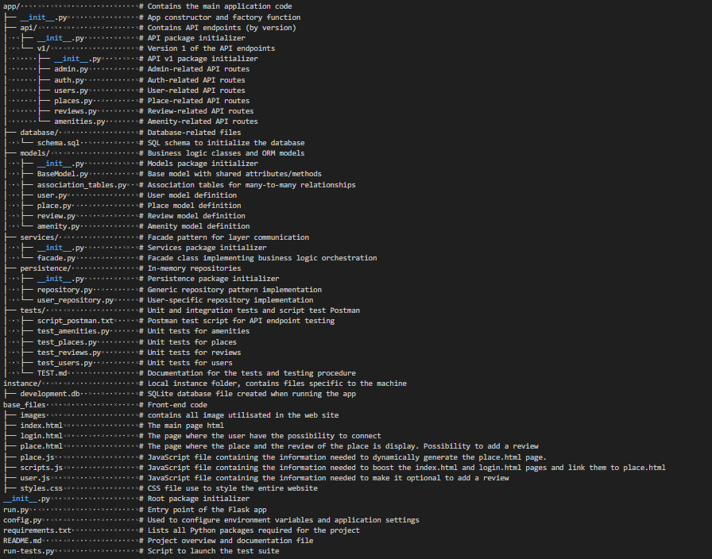
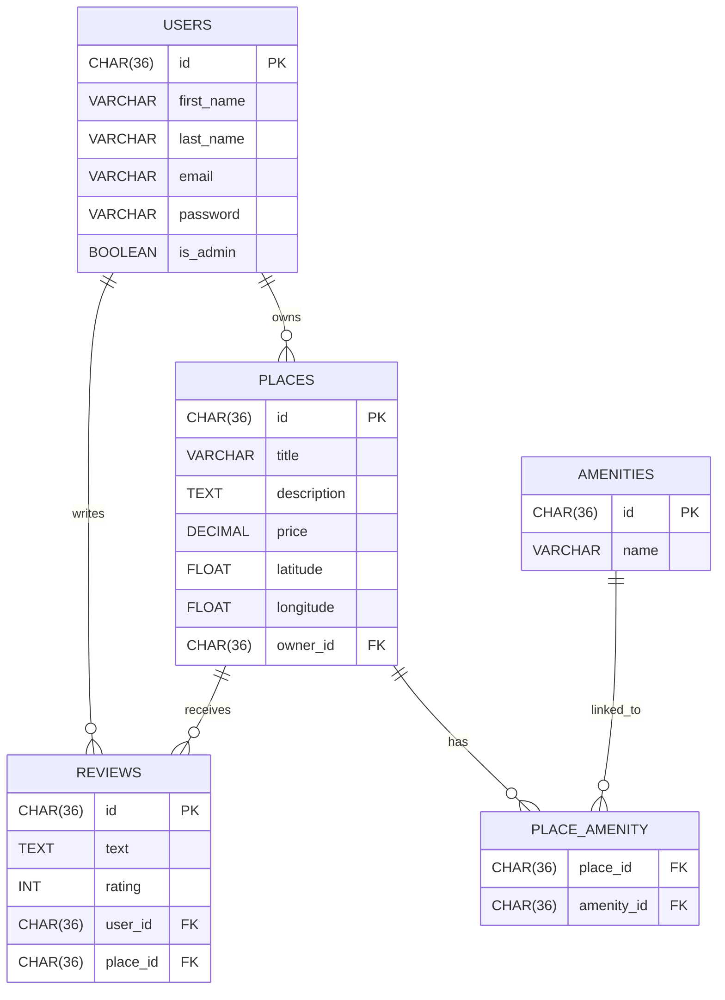
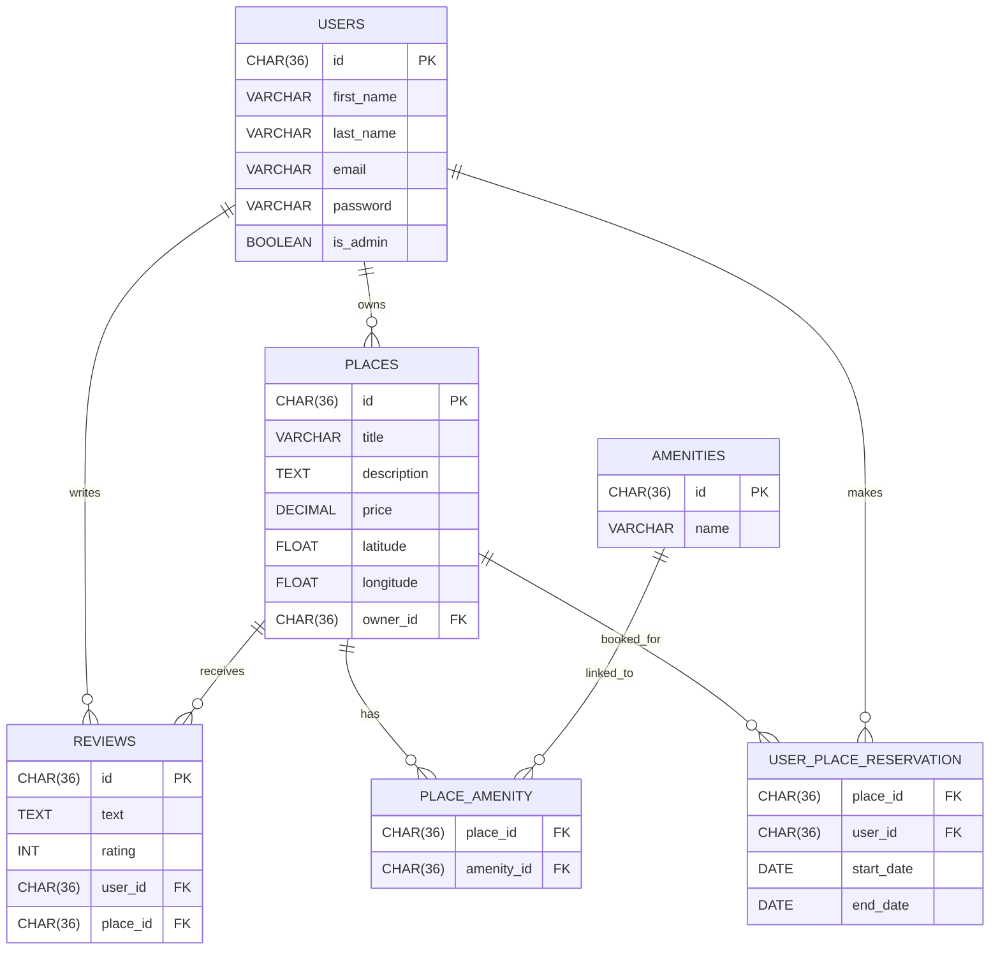
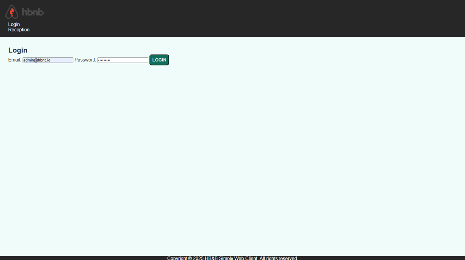

# Welcome to the HBNB - Enhanced Backend with Authentication and Database Integration

## Presentation

HBnB is a RESTful API inspired by the AirBnB website, developed in Python using Flask and Flask-RESTX.  
The project follows a three-layer architecture (presentation, business logic, persistence) introduced in Part 1 of the HBnB project.

## Project Objectives

🔐 Authentication & Authorization:
Implement JWT-based authentication using Flask-JWT-Extended and role-based access control through the is_admin attribute.

🗃️ Persistent Data Storage:
Replace in-memory storage with SQLite for development, and prepare MySQL integration for production environments using SQLAlchemy as the ORM.

⚙️ Database-Backed CRUD Operations:
Refactor all Create, Read, Update, and Delete operations to interact with a relational database.

🧭 Database Modeling and Visualization:
Design the relational schema and visualize entity relationships (User, Place, Review, Amenity) using Mermaid.js.

✅ Data Validation & Consistency:
Enforce data validation and integrity constraints within the SQLAlchemy models.

## Technology Stack

Flask – Web framework for API development
Flask-JWT-Extended – JWT-based authentication
SQLAlchemy – ORM for database modeling
SQLite – Development database
MySQL – Target production database
Mermaid.js – ER diagram visualization tool

## Key Deliverables

A secure and scalable backend API with authentication and authorization.
A fully connected relational database schema using SQLAlchemy models.
Visualized database architecture with Mermaid.js diagrams.
Clear separation of concerns across routes, models, and controllers.

## How to Run the Application

1. Install dependencies using:  
   ```bash
   pip install -r requirements.txt
   ```

2. Run the application:  
   ```bash
   python3 run.py
   ```

3. To run the tests:  
   ```bash
   python3 run_tests.py
   ```

4. Leave the server:  
   Press `CTRL+C` to exit the server. When you launch the server, it should create an `instance` folder with the database file `development.db`.

5. Add the SQL script to the database:
   ```bash
   sqlite3 instance/development.db < app/database/schema.sql
   ```

6. The application should now be running with the SQL script implemented. You can now launch the application and open your web browser, then go to http://127.0.0.1:5000/api/v1

---

## How to Run the Application with the communication front-end/back-end

1. run server back-end in the racine of the part4
	```bash
   python3 run.py
   ```

2. run server front-end int the repository base_files
	```bash
   python3 -m http.server 8000
   ```

3. Welcome to http://localhost:8000/index.html
	mdp administrator : admin1234
	mail administrator : admin@hbnb.io

## Purpose of Each Directory and File




## API Endpoints

User authentication via JWT tokens.
Restricted access to sensitive routes based on user roles (admin vs. regular user).
Passwords securely hashed using bcrypt.

| Method | Endpoint           | Description                   | Auth required |
|--------|--------------------|-------------------------------|---------------|
| POST   | /auth/register     | Register a new user           | ❌            |
| POST   | /auth/login        | Get JWT token                 | ❌            |
| GET    | /users             | List all users (admin only)   | ✅            |
| GET    | /places            | List all places               | ❌            |
| POST   | /places            | Create new place              | ✅            |
| PUT    | /reviews/<id>      | Update review                 | ✅            |
| DELETE | /amenities/<id>    | Delete an amenity (admin)     | ✅            |


## Database Diagram



## Database Diagram with USER_PLACE_RESERVATION Integration



## Simple Web Client

### 1. User login through login.html for a user registered in the database



On the login.html page, we use an email address and password from the database to log in and be redirected to the main page: index.html. if the connexion success, the nav with the text "login" disappear in all pages.

### 2. Presentation of all known locations in the database

On the index.html page, if the user is logged in, they will be able to see the list of locations stored in the database with the option to view details via the buttons on each map. If the user is not logged in, they will not see any locations displayed. There is also the option to choose a maximum price based on values between 10, 50, 100, or to display the entire range (which is the default setting).

### 3. Details of a place and and there is the possibility to view and add a review

On the place.html, if the user requests details about one of the different locations, they will be taken to this page where they will see complete information about the location. They will then be able to see each review that another user has given and can also add one (note that they can only post one review and that the owner of the location cannot leave a review).

## Tests

All our tests were performed using Postman and Swagger, covering all CRUD operations.

## Author

👩‍💻 Robin David
🚀 Full-Stack Web Developer in training at Holberton School Laval — project-based and peer-learning curriculum
